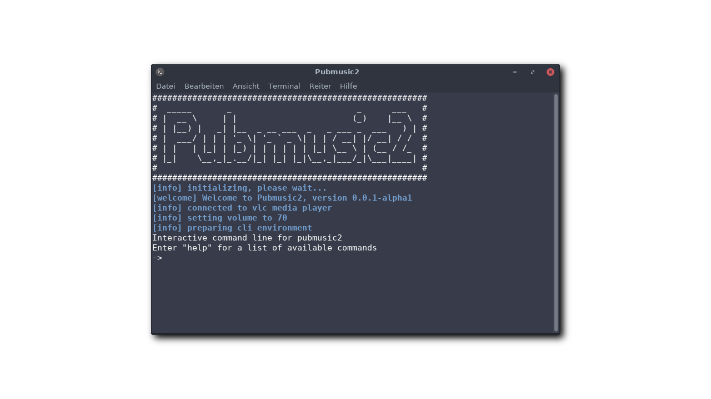

# PubMusic2
Advanced collaborative media player based on python and vlc media player

**Note: This project is in active development and not finished yet**

**Project Homepage:** https://akienz.de/projekte/pubmusic/

This project can be seen like a modern approach of building a music box.
Users can enqueue songs via a web-interface and can i.e. vote for songs or
control the playback. A role managment system is planned so that only 
administrators can access critical functions like Play/Pause and playlist
reordering.

## Requirements

* Linux or Windows operating system (macOS might be coming)
* Python 2.7 or Python 3 environment
* Installation of VLC Media Player

Note: Support for Windows is in early beta. Some features might not be 100% stable

## Launching the application

### Windows

Just double-click on the pubmusic_windows.bat script

### Linux (GUI)

Double-click on pubmusic_linux.sh. You might need to add the executable flag.

### Linux (from terminal)

`python pubmusic.py`

## Contribution

If you like to contribute to this project, feel free to fork and send me a pull
request. Regular contributors can also get direct access to the repository.

## Currently implemented features

* Automatic music library
* Player controller with syncronized playlist
* Random playing modes
* Command line interface
* Logger for displaying information
* Modular structure

## Upcoming features

* Multiuser Web-interface -> `fb-webinterface` branch
* MP3-Tag support
* Auto-DJ based on previous playlists
* permanent library
* permission system
* API for external control (via HTTP-API)
* Configuration file

## Configuration

At the moment, configuration is done via a special class in pubmuisc.py.
There you can set various options like the verbosity level or the media 
directory. Configuration will be extended from time to time to allow more
specific options and use scenarios.

## GTK+ Interface

This software features a simple GTK+ interface, which is disabled by default to
avoid creating a dependency. To enable the interface, set `enableGtkInterface`
to `True` in the configuration class.

**Note:** This interface is still in development and has some bugs which may
lead to random crashes. Do not use this in production.

## License

Licenced under the MIT-License
