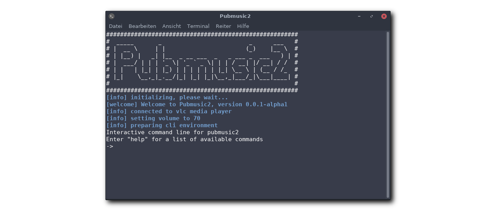

# PubMusic2
Advanced collaborative media player based on python and vlc media player

**Note: This project is in active development and not finished yet**
**Project Homepage:** https://akienz.de/projekte/pubmusic/

This project can be seen like a modern approach of building a music box.
Users can enqueue songs via a web-interface and can i.e. vote for songs or
control the playback. A role managment system is planned so that only 
administrators can access critical functions like Play/Pause and playlist
reordering.

## Requirements

* Unix-based operation system (Multiplatform support is coming soon)
* Python 2.7 or Python 3 environment
* Installation of VLC Media Player

Note: This software can be used on non-unix systems. However, you have to comment
out the line `os.system("nohup /usr/bin/vlc --intf telnet  --telnet-password 
admin &>/dev/null &")` in pubmusic.py and start a telnet instance of vlc
manually

## Contribution

If you like to contribute to this project, feel free to fork and send me a pull
request. Regular contributors can also get direct access if to the repository.

## Currently implemented features

* Automatic music library
* Player controller with syncronized playlist
* Random playing modes
* Command line interface
* Logger for displaying information
* Modular structure

## Upcoming features

* Multiuser Web-interface -> `fb-webinterface` branch
* MP3-Tag support
* Auto-DJ based on previous playlists
* permanent library
* permission system
* API for external control (via HTTP-API)
* Configuration file

## Configuration

At the moment, configuration is done via a special class in pubmuisc.py.
There you can set various options like the verbosity level or the media 
directory. Configuration will be extended from time to time to allow more
specific options and use scenarios.

## License

Licenced under the MIT-License
